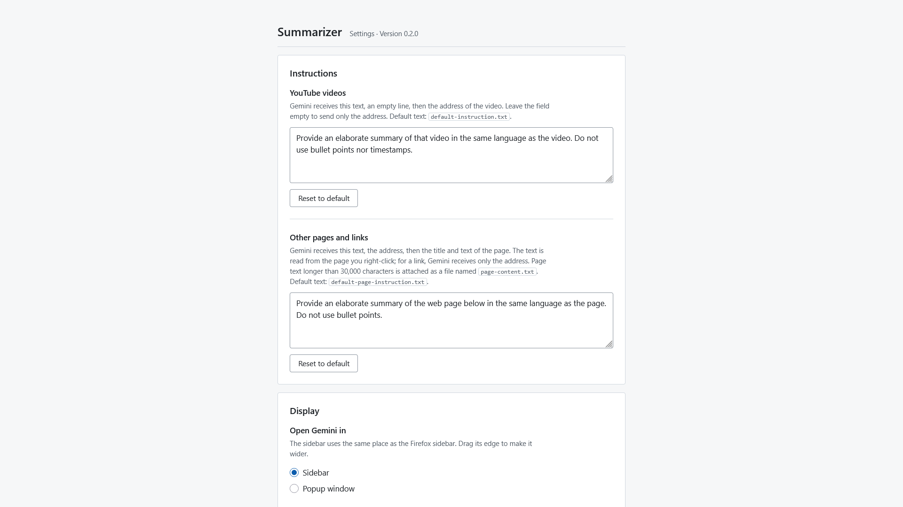

# Summarizer

A Firefox extension that adds a **Summarize** entry to the context menu of web pages and links. It opens [Gemini](https://gemini.google.com) in the sidebar (or in a popup window), fills in a prompt for the page or video you right-clicked, and sends it.

- **YouTube videos** (a video page, or a link to a video): Gemini receives your video instruction, an empty line, then the canonical video address (`https://www.youtube.com/watch?v=<id>`, without playlist, time or tracking parameters).
- **Any other page**: Gemini receives your page instruction, the page address, its title and its text, read from the page you right-clicked. Text longer than 30,000 characters is attached as a file named `page-content.txt`, because the Gemini prompt field cuts longer text.
- **Any other link**: Gemini receives your page instruction and the link address. The linked page is not opened, so its text is not read.

The extension uses the Google account already signed in to Firefox. It does not use the Gemini API, needs no key, and collects no data.

<figure>
  
  <figcaption>The settings page, with the default instructions.</figcaption>
</figure>

## Requirements

- Firefox 142 or later, on desktop.
- A Google account signed in to [gemini.google.com](https://gemini.google.com) in the same Firefox profile.

## Download

Each [release](../../releases) includes two files, built by GitHub Actions:

- `summarizer-<tag>.zip` (for example `summarizer-v0.2.0.zip`): the extension package.
- `summarizer-<tag>.zip.sha256`: its SHA-256 checksum.

To check the download, compare the checksum shown by this PowerShell command with the one in the `.sha256` file:

```powershell
Get-FileHash .\summarizer-v0.2.0.zip -Algorithm SHA256
```

The package is **not signed** by Mozilla. Firefox (release version) only installs signed extensions permanently, so use one of the methods below.

## Installation

Firefox menus and settings change between versions; the steps below may differ slightly in yours.

### Option 1: temporary installation (for testing)

1. Open `about:debugging#/runtime/this-firefox`.
2. Click **Load Temporary Add-on...** and choose the `.zip` file, or `manifest.json` from a copy of this repository.

The extension stays installed until Firefox closes.

### Option 2: sign it yourself as an unlisted add-on (permanent, any Firefox)

1. Sign in at [addons.mozilla.org/developers](https://addons.mozilla.org/developers/).
2. Choose **Submit a New Add-on**, then **On your own**. The add-on is signed but not listed publicly.
3. Upload the `.zip` file. Answer **No** to the question about source code: the code is neither minified nor transpiled.
4. After the automatic review, download the signed `.xpi` file and drag it onto a Firefox window.

Each add-on ID can only be registered by one account. If you publish your own copy, put a new ID in `browser_specific_settings.gecko.id` in `manifest.json` first. For later updates, use **Upload New Version** on the same add-on, with a higher version number. Do not delete the add-on on addons.mozilla.org: a deleted ID can never be used again.

### Option 3: Firefox Developer Edition or Nightly with signing turned off

1. Open `about:config` and set `xpinstall.signatures.required` to `false`.
2. Open `about:addons`, click the gear menu, then **Install Add-on From File...**, and choose the `.zip` file.

This preference has no effect in the release version of Firefox.

## Permissions

| Permission | Why it is needed |
|---|---|
| `contextMenus` | Adds the Summarize entry to the context menu. |
| `storage` | Saves the settings and the size and position of the popup window, on this computer only. |
| `clipboardWrite` | When the prompt cannot be filled in, copies its text to the clipboard so you can paste it. |
| `activeTab` | Gives access to the page you right-clicked, only at the moment you click Summarize. |
| `scripting` | Reads the title and text of that page. |
| Access to `gemini.google.com` | Runs the script that fills in and sends the prompt on Gemini. |

Firefox may let you turn off access to `gemini.google.com` in `about:addons` (Permissions tab). Without it, the prompt cannot be filled in: Summarize then opens the settings page, which shows a button to allow access again.

## Settings

Open them from `about:addons`, then Summarizer, then **Preferences**. Every change is saved immediately.

- **Instructions**: one for YouTube videos and one for other pages and links. Leave a field empty to send no instruction. **Reset to default** restores the text shipped with the extension.
- **Open Gemini in**: the sidebar (default) or a popup window.
- **Send automatically**: when off, the prompt is filled in and you send it yourself.
- **Popup window**: reuse the window that is already open, and reset its saved size and position.

### Changing the default instructions

The default texts live in two files at the root of the extension:

- `default-instruction.txt`: instruction for YouTube videos.
- `default-page-instruction.txt`: instruction for other pages and links.

Edit them before packaging the extension to change the defaults, or simply edit the fields on the settings page, which take priority.

## Known limitations

- **Gemini layout**: the extension finds the prompt field and the send button on the Gemini page. Google changes this page often, which can break filling in or sending. All the selectors are in `src/content/selectors.js`, with comments, to make them easy to update. When filling in fails, the text is copied to the clipboard and a notice asks you to paste it with Ctrl+V.
- **Google sign-in**: you must be signed in to Gemini in the same Firefox profile.
- **Attached file**: attaching long page text relies on a simulated file drop on the Gemini page. If it fails, the text is cut to fit the prompt field and a notice says so.
- **Pages that cannot be read**: Firefox pages, PDF viewers and some protected sites do not let extensions read their text. Gemini then receives the instruction and the address only.
- **Window position**: Firefox does not report window moves to extensions, so the popup window checks its own position once per second while it is open.

## Development

Requirements: [Node.js](https://nodejs.org) 24.

```bash
npm ci
```

```bash
npm test
```

```bash
npm run lint
```

```bash
npm start
```

`npm start` runs `web-ext run`, which opens a new Firefox profile with the extension loaded. That profile is not signed in to Google, so for real tests load `manifest.json` in your own profile through `about:debugging` instead.

```bash
npm run build
```

`npm run build` writes the package to `web-ext-artifacts/`.

To preview the settings page in any browser, without Firefox:

```bash
node test/preview/serve.js
```

Then open `http://localhost:8123/test/preview/options-preview.html`. Add `?access=off` to the address to see the warning shown when access to Gemini is turned off.

### Releases

Publishing a release on GitHub runs the workflow in `.github/workflows/release.yml` on Windows. It runs the tests and the linter, writes the release tag (without the leading `v`) as the version in `manifest.json`, builds `summarizer-<tag>.zip`, computes its SHA-256 checksum, and attaches both files to the release.

To test the packaging without a release, open the **Actions** tab, choose **Release package**, then **Run workflow**. The files are then kept as a workflow artifact.

## Project structure

```
manifest.json                  Extension manifest (Manifest V3)
default-instruction.txt        Default instruction for YouTube videos
default-page-instruction.txt   Default instruction for other pages
icons/summarize.svg            Extension and menu icon
src/background.js              Context menu, Gemini window or sidebar, page reading
src/prompt.js                  Builds the prompt and the attached file
src/youtube-url.js             Normalizes YouTube video addresses
src/content/gemini.js          Fills in and sends the prompt on Gemini
src/content/selectors.js       All selectors for the Gemini page
src/options/                   Settings page
src/sidebar/sidebar.html       Sidebar page shown before Gemini loads
test/                          Unit tests (node:test) and settings page preview
docs/screenshots/              Screenshots for this README
.github/workflows/release.yml  Packages the extension when a release is published
web-ext-config.mjs             web-ext settings and files left out of the package
```

## License

The license has not been chosen yet. Until a license is added, all rights are reserved by the author.
